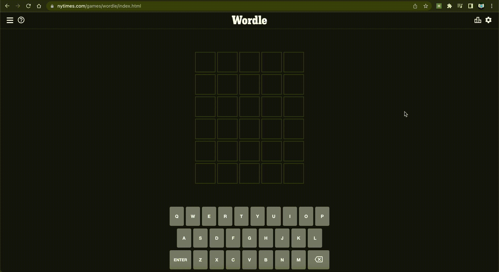

# Wordle Companion

Contains a web extension for helping you solve Wordle on the site and a set of CLI utilities.

## Web Extension

Web Store Link: https://chrome.google.com/webstore/detail/wordle-companion/fajappoenpihanjjpnokmihlmehjfchp




### Build

```bash
> web-ext build --source-dir=/path/to/wordle/webextension --artifacts-dir=/path/to/wordle/webextensio/build --overwrite-dest
```

## CLI Utilities

### Solver

You can indicate previous guesses using the following mapping:

| Letter | Meaning       |
| ------ | ------------- |
| g      | green letter  |
| y      | yellow letter |
| r      | grey letter   |

```bash
❯ node cli/cli/solver.js
sorel

❯ node cli/solver.js sorel yrryr
haets

❯ node cli/solver.js sorel yrryr haets yrgyy
these

❯ node cli/solver.js sorel yrryr haets yrgyy these ygggy
chest
```

### Reverse Solver

Target answer: chest

```bash
❯ node cli/reverse.js chest
sorel
haets
these
chest
```

### Benchmark

```bash
❯ node cli/benchmark.js
Total Guesses: 64713
Total Words: 12972
Average Guesses: 4.988667900092507
```
